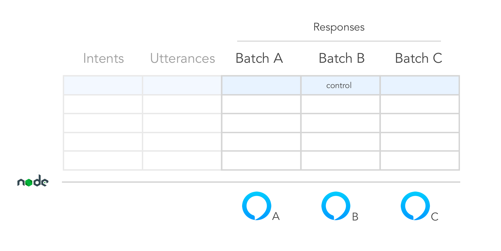
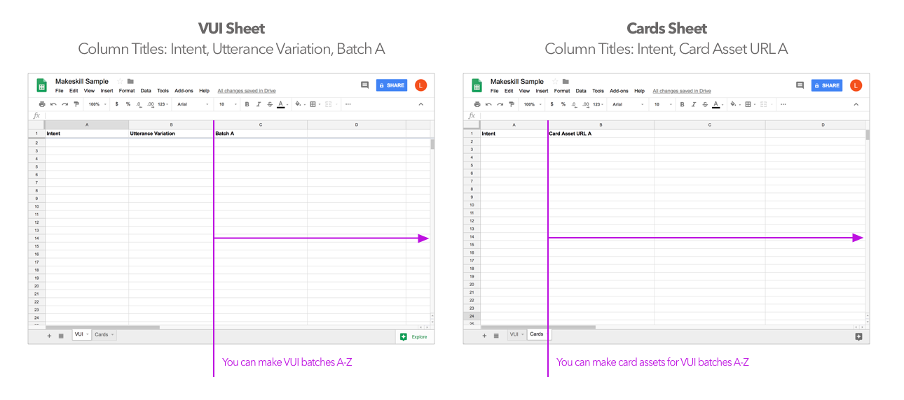
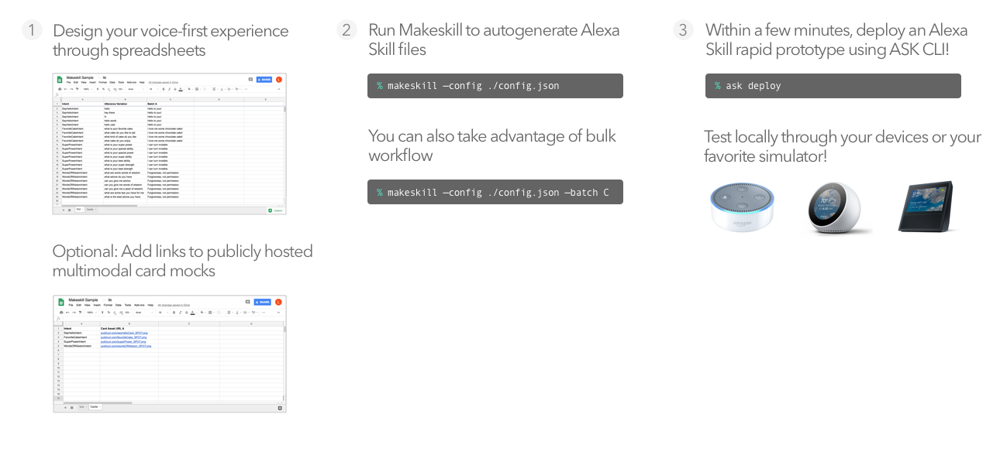
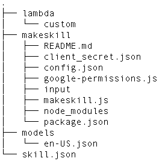
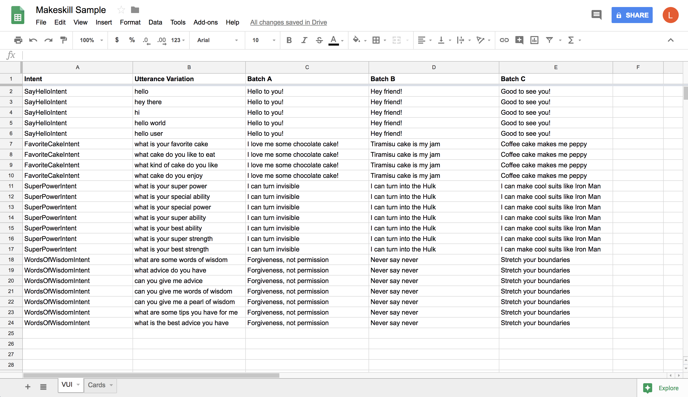
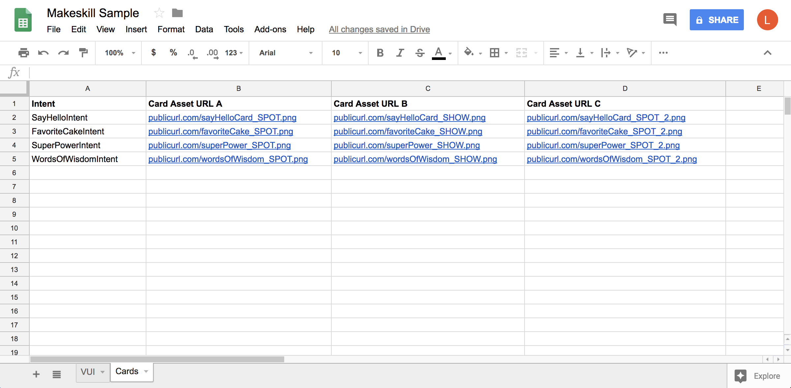
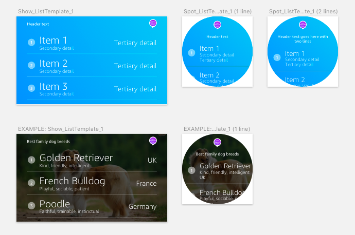
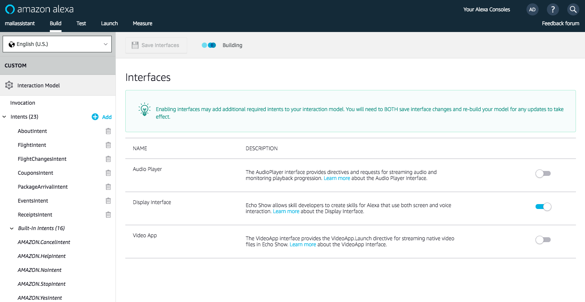
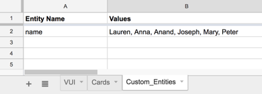

> A multimodal rapid prototyping suite for the Alexa platform using Google Sheets

# Makeskill Design Kit

Makeskill is a Node.js tool that parses a Google Spreadsheet to output batches of Alexa Skill rapid prototypes. Collaborate with your stakeholders through a familiar tool like Google Spreadsheets to make quick Alexa Skills in bulk for testing your concepts. It works best with
[Amazon's ASK CLI](https://developer.amazon.com/docs/smapi/quick-start-alexa-skills-kit-command-line-interface.html) to have a continuous flow between Makeskill automation and deploying through ASK.

The Makeskill design in a nutshell:


## Table of Contents

- [Background](#background)
- [Install](#install)
- [Configuration](#configuration)
- [Usage](#usage)
- [Contribute](#contribute)
- [License](#license)

## Background

This project was spearheaded by a small design team that invented a new methodology for prototyping voice interfaces. It's in an alpha state, so expect bugs and inconsistencies.

Makeskill includes the following features:
* Auto-generate interaction model and AWS Lambda function (en-US locale) - compatible with ASK CLI
* Can write A-Z Skill batches (Lambda function variations), export 1 at a time
* Accounts only for 1 turn utterance/response interactions
* Early custom slot support
* Early multimodal prototyping support (Echo Show and Echo Spot)
* Can handle Speechcons in SSML in the Batch columns

## Install

### Requirements
* Latest Node.js (or v6.11.4)
* Latest npm (or 3.10.10)
* Amazon Developer Account / [ASK CLI](https://developer.amazon.com/docs/smapi/set-up-credentials-for-an-amazon-web-services-account.html) / [IAM Permissions](https://console.aws.amazon.com/iam/home#/home)
* Google Spreadsheets / [API Key Docs](https://developers.google.com/sheets/api/guides/authorizing)


### After Downloading the Repository
In the root level of your target directory (e.g. an Alexa Skills Kit CLI template folder), add the Makeskill repository.

Before you can use the makeskill tool, you'll need to link:
```sh
  npm link
```

Then in the Makeskill folder, install all of its node module dependencies
```sh
  cd makeskill
  npm install
```

## Configuration

You can use the mdk_starter script to generate the Makeskill config file.
```sh
$ chmod u+x mdk_starter.js
$ ./mdk_starter
```

Within Makeskill's config.json, you should see something like the following:

```sh
  {
    "invocationName" : "[NAME_OF_SKILL]",

    "googleSecret" : "./client_secret.json",
    "sheetId" : "[SHEET_ID]",
    "vuiSheet" : "[VUI_SHEET_NAME]",
    "multimodalCards" : "[CARD_SHEET_NAME]",
    "customEntities": "[CUSTOM_ENTITIES_SHEET_NAME]",
    "defaultBatchLetter" : "A",

    "lambdaFolder": "../lambda/custom",
    "modelsFolder": "../models"
  }
```
In practice, you'll likely be setting this config file once. The default batch
you'll be exporting according to this config is "A".

#### Invocation Name
This is a lowercase name that is easy for Alexa to pick up as a user
pronounces it.  See recommendations from the [Alexa invocation name guidelines](https://developer.amazon.com/blogs/post/Tx1I0GCST7POI00/tips-for-choosing-an-invocation-name-for-your-alexa-custom-skill).


#### Google Secret
After following the instructions in Google's [API Key Docs](https://developers.google.com/sheets/api/guides/authorizing) and [Quick Start with Nodejs](https://developers.google.com/sheets/api/quickstart/nodejs), you can generate a
client_secret.json file. In that file, you should have a structure that looks like:

```sh
{  
   "installed":{  
      "client_id":"[UNIQUE_ID].apps.googleusercontent.com",
      "project_id":"[PROJECT_ID]",
      "auth_uri":"https://accounts.google.com/o/oauth2/auth",
      "token_uri":"https://accounts.google.com/o/oauth2/token",
      "auth_provider_x509_cert_url":"https://www.googleapis.com/oauth2/v1/certs",
      "client_secret":"[SECRET]",
      "redirect_uris":[  
         "urn:ietf:wg:oauth:2.0:oob",
         "http://localhost"
      ]
   }
}
```

The ```googleSecret``` attribute in our Makeskill config.json file references this client_secret.json in order to permit Makeskill to talk to your Google Spreadsheets.


#### Sheet ID
You'll be adding the ID sandwiched between "d/" and "/edit#gid=0" in your Google Spreadsheet URL to reference in the ```sheetId``` attribute in our Makeskill config.json file:


#### VUI Sheet
This is the name of the sheet you'll be parsing from that's designated only to VUI batches.


#### Multimodal Cards
This is the sheet responsible for card asset URLs for either Echo Show or Echo Spot. Pair the card batch columns accordingly with VUI sheet columns.  Card assets are mapped to the VUI responses via intents.  If you want to turn off multimodality, use "" as the assignment.


#### Default Batch Letter
By default, the config file has batch A exporting for you, which is indicated by "A".  Batches B, C, etc would be
denoted by "B", "C", etc up to Z, respectively.


#### Lambda and Models Folders
In the folders of your choosing, select where the Lambda function and Interaction Model files will be generated.  If
using an ASK CLI template, the file paths should be ```../lambda/custom``` and ```../models``` respectively.

### Makeskill Spreadsheet Setup


## Usage

### Workflow At A Glance
Plan dialogs and early card design concepts through Spreadsheets. All of the Skill coding is abstracted away (though a developer can easily pick up the autogenerated lambda and interaction model code later). Therefore, you and your team can truly focus on tinkering with the copywriting and experience design as soon as possible!




### Using Makeskill with ASK CLI
The ideal approach is to use Makeskill with the ASK CLI.  Simply create a new default template via the ASK CLI then install Makeskill within the directory. Makeskill will override the default interaction model and lambda functions.

After proper installation within the ASK CLI framework, your file tree should look like this:



If you're not using the ASK CLI, you'll need to change the config file to specify a destination for the auto-generated files.  You can manually copy and paste these files into the ASK and AWS tools.

### Designing A Single Skill

#### Step 1: Fill out the Google Sheets


For an individual 1-turn Skill, simply fill out your spreadsheet to mimic the following
layout for sheet name "VUI".  Replace with your Skill's Intents, include utterance variations, and ensure the corresponding responses line up with those intents.


Multimodality is optional in Makeskill. If enabled, you'll need a spreadsheet that looks similar to this for sheet name "Cards". For more details, refer to the README section on Multimodality.

#### Step 2: Export the Skill
When you are finished editing your Google Spreadsheet, you'll need to run the Makeskill command
from the Makeskill root folder.

Export the default batch (based on config file):
```sh
 makeskill --config ./config/config.json
```

#### Step 3: Deploy
Now you're ready to deploy. Switch to the project root folder to interact with the ASK CLI.

Deploy your prototype (from project root folder):
```sh
 ask deploy
```

You can now test locally via your device or a preferred simulator.

### Handling Multiple Batches

#### Step 1: Prepare Your Batches

The philosophy behind Makeskill is the ability to design in bulk in order to pump out multiple
Skill experiments. In this sample for sheet name "VUI", a user can export either batch A, B, or C to acquire a corresponding Skill to deploy. When designing multiple batches, the recommendation is to design 3 batch variations at a time with 1 batch being a control.  If needed, Makeskill can account for batches A-Z.  Currently, a developer can export one of the variations at a time.


Here, we see a sheet name "Cards" that contains public links to card assets.  Each card asset column represents a batch.

#### Step 2: Export Your Batch
Let's say you wanted to export Batch C:
```sh
 makeskill --config ./config/config.json --batch C
```

#### Step 3: Deploy
Switch to the project root folder. Then you can deploy away.

Deploy your prototype (from project root folder):
```sh
 ask deploy
```

You can now test locally via your device or a preferred simulator.

### Early Support for Multimodality
We want to equip designers with a quick way to preview their Echo Show and Echo Spot cards without having to commit to all the nuances behind body templates in code. Makeskill will parse the Google Spreadsheet for links to public PNGs of whole card mocks.

You can download some templates here. The Sketch file shows a rough approximation to what your cards will look like, as the Echo fonts are proprietary.

[](./docs/sketch_templates/card_templates_workshop.sketch)


Here's an example of what these cards could look like:


Discern what body template mocks to use for your respective intents. See [Amazon's Design Guidelines](https://developer.amazon.com/designing-for-voice/what-alexa-says/).

You'll need to host your card PNG exports publicly. A few options:
 * https://cloudinary.com
 * https://www.dropbox.com - we've found that when copying a shareable Dropbox link to your asset,
   you can change the URL to look like the following:
   ```https://www.dropbox.com/s/[your_image_ID].png?raw=1```


If you are testing with multimodality, you will need to enable "Display Interface" in the Interfaces tab of the ASK tool.

You do not need to run makeskill again if you update your mocks.  As long as your public URL is the same, you can simply re-upload your file to your host and test the device for the new change.


Note: you can only test either 1 Echo Show or 1 Echo Spot card mock but not both for each intent right now. So if you'd like, you can make a batch where all of the card assets are Echo Show and then another batch where all of the assets are Echo Spot.

### Using Slots
Slots are useful for making your interaction model smarter. Makeskill Slots have very similar syntax to how you would manually write slots in your interaction model.

#### Slots: Custom and Amazon Defaults
Simply depict a new slot name within the "{}" notation. For custom entities, you can make another sheet tab within called "Custom_Entities" and you can cross-reference those entity definitions from your utterance variations.


Otherwise, if you take a look at Amazon's default supported slots in [Slot Type Reference](https://developer.amazon.com/docs/custom-skills/slot-type-reference.html), you can simply refer as "{A.SLOT_NAME}".


#### Custom Entities
If you're making your own slots, be sure to define the custom entities in a separate sheet. Makeskill will automatically render the new interaction model with your canned values.



### SSML Speechcons
These response batches will automatically be wrapped in SSML, so a user can also embed [Speechcons](https://developer.amazon.com/docs/custom-skills/speechcon-reference-interjections-english-us.html) in the spreadsheet batches to add humanization to Alexa's answers. Use single quotes within your markup.

```
<say-as interpret-as='interjection'>aw man</say as>! We ran out of chocolate pie!
```
### Evolutionary Prototyping
When you are finished with testing out your Skill concepts in a rapid fashion, you are free to evolve the autogenerated code however you see fit.  Makeskill is simply a scaffold for your project, but you'll be responsible for making the code production-ready.

For multimodality, refer to the list of body templates and upgrade the directives for the respective intents you want new cards for in your generated Lambda file.  See [Display Interface Reference](https://developer.amazon.com/docs/custom-skills/display-interface-reference.html).


## Contribute
Makeskill is still in its infancy, and our desire is to enable anyone to rapidly prototype Alexa skills with ease, across the Echo family. Refer to our [contributing guide](./Contributing.md) for details about how to get involved.

## License

This project is licensed under the terms of the [MIT](LICENSE-MIT) open source license. Please refer to [LICENSE](LICENSE) for the full terms.

